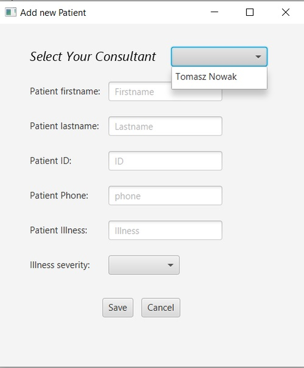

# OOProgramming_Project

### Object-Oriented Programming module taught at MTU, project name "Hospital Consultancy Application" using JavaFX for creating GUI.

This is what we see when the application is running. Image of tab 1 with available options.

### Menu bar
At the top we can see the menu bar with two options: File and Help.

When we go to the File the options are: Load From File, Save To File, and Exit. When we select Load Form File data will be loaded from serial file. And if we select Save To File data from application will be saved the serial file.

When we decide to press Exit button the warning information will appear. 

In help tab there is only one option, if you click about button... 

...information about the author of the project will be displayed.

### Tab 2 (Consultants)
The second tab is for managing consultants. We can add new consultants, edit existing consultants or delete them.

Click add consultant, a new window appears in which we enter the details of the new consultant. All fields must be correctly completed. And then press Save.

 

After adding a new consultant, all buttons become active. Now we can edit the existing consultant or delete.

Now we can edit the consultant. Previously entered data can be changed. To save changes, click Save changes.

To delete consultant press Delete Consultant.

### Tab 1 (Patients)

The first tab is for managing patients and adding visits. Patients can only be added to an existing consultant. Press the add Patient button and a new window will appear where we enter the patient's data.

First select existing consultant from drop down list.

Next complete patient details, illness severity must be selected from drop down list. There are three options: Low, Medium and High. And press Save.

When patient is added, now we can edit the patient. Previously entered data can be changed. To save changes, click Save changes.

