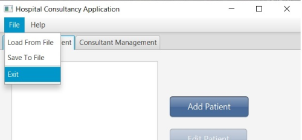

# OOProgramming_Project

### Object-Oriented Programming module taught at MTU, project name "Hospital Consultancy Application" using JavaFX for creating GUI.

This is what we see when the application is running. Image of tab 1 with available options.

At the top we can see the menu bar with two options: File and Help.

If we go to the File the options are: Load From File, Save To File, and Exit. If we select Load Form File data will be loaded from serial file. And if we select Save To File data from application will be saved the serial file.

If we decide to press Exit warning information wil appear. 

